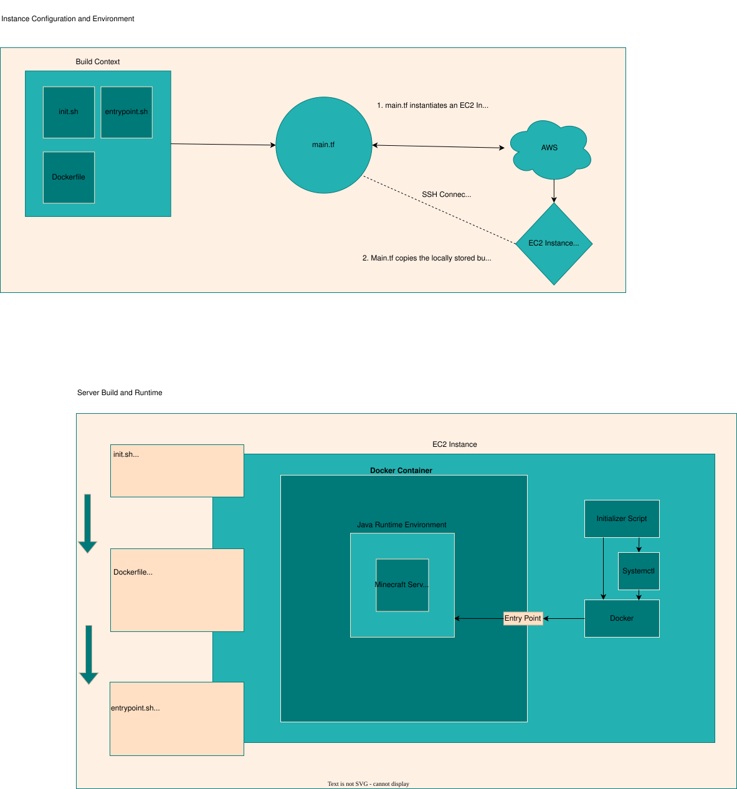

# Background
This is a deployment of a simple minecraft server via AWS EC2 instance.
The deployment runs a containerized amazon machine image preinstalled with Java Runtime Environment. The initialization script checks for idempotency and allows Java to facilitate the termination process to that minecraft worlds aren't corrupted or unintentionally reset.

## Requirements
This repo was developed in an Ubuntu environment and has not been tested in any other environment. The following are required to successfully build out of the box:
- Terraform
- An AWS account, which you'll use to expose
  - an access key,
  - a key id,
  - a session token,
  - and an aws region.

# Tutorial
## Setting up
1. If you don't have it, install terraform: `sudo apt install -y && snap install terraform`
2. Initialize the terraform backend: `terraform init`
3. Provide AWS API information:
    ```bash
    export AWS_ACCESS_KEY_ID="<your-key-id>"
    export AWS_SECRET_ACCESS_KEY="<your-secret-key>"
    export AWS_REGION="<your-aws-region>"
    ```
    If using AWS through a managed SSO session, a session token is also necessary:

    `export AWS_SESSION_TOKEN=<current-session-token>`
4. The deployment also requires an ssh connection to the EC2 instance.

    Create a key pair: `ssh-keygen -t ed25519 -f ~/.ssh/minecraft_key -N "" -C "minecraft_admin"`
    
    The Terraform script will automatically use keys generated with the command above.


## Building
1. Create a terraform plan: `terraform plan -out "mc-server"`
2. Execute the plan: `terraform apply "mc-server"`

## Connecting
After the plan executes, it will return the ip address for an EC2 instance.
To test for a connection, run `nmap -sV -Pn -p T:25565 <EC2.public.ip>`

To connect to the server, open an instance of minecraft Java edition, and join the server
at the EC2 ip address.

# Pipeline
For those who are interested, the following diagram describes the IaC structure of this repo.


